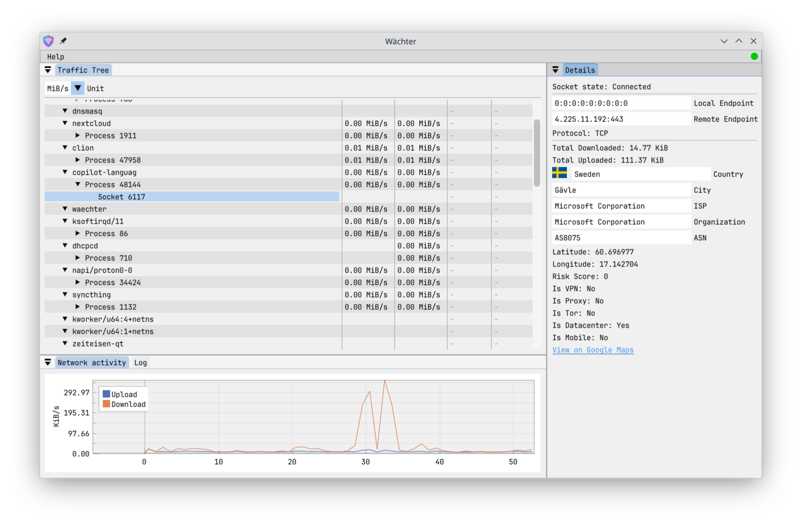

## Wächter [*/ˈvɛçtɐ/*]

A Linux traffic monitoring and shaping tool.

Wächter uses eBPF to capture and throttle network packets and gather detailed statistics about network usage. It is
divided up into three parts:

- An eBPF program that hooks into the Linux kernel to capture network packets and gather statistics
- A daemon that loads the eBPF program, reads data from it and keeps track of network usage statistics and rules
- A client GUI that allows users to view statistics and configure rules for traffic shaping

Build requirements:

- [libbpf](https://github.com/libbpf/libbpf)
- [CMake](https://cmake.org/)
- A recent Linux kernel with eBPF support
- `bpftool` to create vmlinux.h
- `clang` and `llvm` to compile eBPF programs